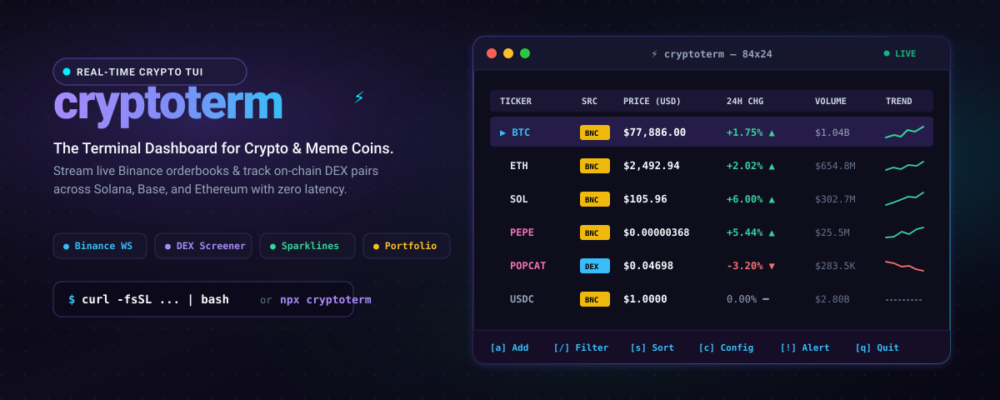

<p align="center">
  
</p>

# cryptoterm

<p align="center">
  <strong>A high-performance, keyboard-driven terminal dashboard for real-time cryptocurrency &amp; DEX meme coin market data.</strong>
</p>
<p align="center">
  <a href="https://github.com/fchyoga/cryptoterm/releases"></a>
  <a href="https://pkg.go.dev/github.com/fchyoga/cryptoterm"></a>
  <a href="https://goreportcard.com/report/github.com/fchyoga/cryptoterm"></a>
  <a href="LICENSE"></a>
  <a href="https://github.com/fchyoga/cryptoterm/pulls"></a>
</p>

---

```
⚡ CRYPTO TERMINAL     [1] Watchlist     [2] Meme Radar     [3] Portfolio     [4] Detail    ● BNC WS  ● DEX  [USD]  07:55:00 UTC
──────────────────────────────────────────────────────────────────────────────────────────────────────────────────
TICKER        SRC    CAT    PRICE          24H CHG     24H HIGH     24H LOW      VOLUME      TREND
▶ BTC          BNC   MAJOR  $77,820.00     + 1.75% ▲   $77,850.00   $76,000.00   $1.04B      ⡠⠤⠒⠊⠉
  ETH          BNC   MAJOR  $2,493.40      + 2.02% ▲   $2,498.68    $2,428.12    $654.80M    ⡠⠤⠒⠊⠉
  SOL          BNC   MAJOR  $106.06        + 6.00% ▲   $106.12      $99.53       $302.75M    ⣀⠤⠒⠊⠉
  BNB          BNC   MAJOR  $753.81        + 3.97% ▲   $759.31      $720.89      $126.86M    ⡠⠤⠒⠊⠉
  USDC         BNC   STABL  $1.00           -0.01% ▼   $1.00        $1.00        $2.80B      ━━━━━━━━━━
  FDUSD        BNC   STABL  $0.9991        + 0.04% ▲   $0.9994      $0.9984      $29.30M     ━━━━━━━━━━
  DOGE         BNC   MEME   $0.0844        + 3.99% ▲   $0.0847      $0.0806      $53.48M     ⡠⠤⠒⠊⠉
  PEPE         BNC   MEME   $0.00000368    + 5.44% ▲   $0.00000370  $0.00000345  $25.53M     ⡠⠤⠒⠊⠉
  WIF          BNC   MEME   $2.14           + 5.30% ▲   $2.25        $1.98        $340.00M    ⡠⠤⠒⠊⠉
  POPCAT (SOL) DEX   MEME   $0.8520        - 3.20% ▼   $0.9100      $0.8300      $95.00M     ⠉⠉⠒⠤⣀
──────────────────────────────────────────────────────────────────────────────────────────────────────────────────
[a] Add  [d] Remove  [/] Filter  [s] Sort  [c] Config  [!] Alert  [r] Refresh  [?] Help  [q] Quit
```

---

## Overview

Modern crypto traders frequently juggle heavy web applications (TradingView, exchange dashboards, on-chain scanners) that consume excessive memory and introduce unnecessary latency.

`cryptoterm` is an ultra-lightweight, native terminal user interface (TUI) engineered for speed and clarity. Built with Go and the [Charm](https://charm.sh) ecosystem ([Bubble Tea](https://github.com/charmbracelet/bubbletea), [Lip Gloss](https://github.com/charmbracelet/lipgloss)), it unifies **centralized exchange feeds (Binance)** and **decentralized liquidity pools (DexScreener)** into a single ergonomic dashboard.

Whether monitoring benchmark assets ($BTC, $ETH, $SOL), observing stablecoin pegs, or tracking micro-cap meme coin launches across Solana, Base, or Ethereum, `cryptoterm` provides instant visibility with zero friction.

---

## Architecture & Core Capabilities

```
                       ┌─────────────────────────────────┐
                       │           cryptoterm            │
                       │     (Bubble Tea Event Loop)     │
                       └────────────────+────────────────┘
                                        │
           ┌────────────────────────────┴────────────────────────────┐
           ▼                                                         ▼
┌───────────────────────┐                                 ┌───────────────────────┐
│   Binance Engine      │                                 │     DEX Engine        │
├───────────────────────┤                                 ├───────────────────────┤
│ • WebSocket Stream    │                                 │ • DexScreener Client  │
│   (Combined MiniTicker│                                 │ • Multi-Chain Scanner │
│    @ 100ms ticks)     │                                 │   (Solana, Base, ETH) │
│ • Signed REST API     │                                 │ • On-Chain Liquidity, │
│   (HMAC-SHA256 Spot   │                                 │   FDV & Volume Metrics│
│    Portfolio Balances)│                                 │ • Contract Address CA │
│ • Vision Edge Mirror  │                                 │   Auto-Detection      │
└───────────────────────┘                                 └───────────────────────┘
           │                                                         │
           └────────────────────────────┬────────────────────────────┘
                                        ▼
                       ┌─────────────────────────────────┐
                       │    Local Persistent Storage     │
                       │ (~/.config/cryptoterm/cfg.json) │
                       └─────────────────────────────────┘
```

### Key Engineering Highlights

- **Dual Market Data Pipeline**: Consumes real-time trade ticks over WebSocket streams while asynchronously polling on-chain liquidity pools via DexScreener.
- **Zero-Configuration Startup**: Immediate out-of-the-box operation. No API keys, accounts, or tokens required to monitor public markets.
- **Smart Contract Auto-Detection**: Pass either a standard exchange ticker (`BTC`, `ETHUSDT`, `DOGE`) or paste a raw on-chain mint/token contract address (e.g., Solana SPL or EVM token address); `cryptoterm` automatically categorizes and routes the data source.
- **Restricted Network Resilience**: Built with automatic endpoint fallback utilizing Binance's official Vision edge mirrors (`data-stream.binance.vision` & `data-api.binance.vision`). Operates seamlessly across ISP-filtered networks, regional blocks, and corporate proxies without requiring a VPN.
- **High-Resolution Braille Sparklines**: Renders dynamic price trajectory micro-charts directly inside terminal row buffers without external graphical dependencies.
- **Local Credential Boundary**: If you choose to monitor spot wallet balances via Binance API, your credentials are encrypted locally on disk at `~/.config/cryptoterm/config.json` and transmitted strictly to Binance's signed endpoints via HMAC-SHA256. Zero telemetry, zero analytics, zero intermediaries.
- **Audio & Visual Price Alerts**: Set arbitrary price thresholds on any tracked pair. Crossings trigger immediate visual badges and native terminal bell (`\a`) audio cues.

---

## Installation

### Method 1: Automated Shell Installer (macOS & Linux)

The quickest method to download, compile, and place the executable in your system path:

```bash
curl -fsSL https://raw.githubusercontent.com/fchyoga/cryptoterm/main/scripts/install.sh | bash
```

### Method 2: Go Toolchain

If you have Go (1.22+) installed on your machine:

```bash
go install github.com/fchyoga/cryptoterm/cmd/cryptoterm@latest
```

*Ensure `$GOPATH/bin` (or `~/go/bin`) is present in your system `$PATH`.*

### Method 3: Zero-Install via NPX (Node.js Users)

Run directly in your terminal without manual binary placement:

```bash
npx cryptoterm
```

Or install globally via npm:

```bash
npm install -g cryptoterm
```

### Method 4: Build from Source

```bash
# Clone the repository
git clone https://github.com/fchyoga/cryptoterm.git
cd cryptoterm

# Build standalone stripped binary
make build

# Install to /usr/local/bin (or ~/.local/bin)
make install
```

Once installed, launch the dashboard from anywhere:

```bash
cryptoterm
```

---

## Keyboard Navigation & Controls

`cryptoterm` follows standard Unix terminal conventions (Vim-style navigation and single-key actuation):

| Key | Context | Action |
| :--- | :--- | :--- |
| `Tab` / `Shift+Tab` | Global | Cycle forward/backward between tabs |
| `1` - `4` | Global | Jump directly to tab: `[1] Watchlist`, `[2] Meme Radar`, `[3] Portfolio`, `[4] Detail` |
| `↑` / `↓` or `j` / `k` | List | Move cursor selection up / down |
| `Enter` | List | Drill into detailed view for selected asset (deep statistics & enlarged sparkline) |
| `a` | Global | **Add Token**: Opens interactive modal (supports exchange symbols and on-chain contract addresses) |
| `d` or `x` | Watchlist | **Delete Token**: Removes selected token from local watchlist |
| `/` | Watchlist | **Live Filter**: Instant substring search across token symbols, names, and categories |
| `s` | Watchlist | **Sort Cycle**: Switch sorting by Default, 24h Change (%), Price, Volume, or Name |
| `c` | Global | **Configuration**: Set Binance API credentials, toggle currency display (`USD` / `IDR`), toggle sound |
| `!` | Watchlist | **Price Alert**: Arm a price threshold alert on the selected asset |
| `r` | Global | **Hard Refresh**: Force synchronization of market data feeds and portfolio balances |
| `?` or `h` | Global | Toggle keyboard shortcuts modal overlay |
| `q` or `Ctrl+C` | Global | Gracefully terminate program and restore alternate screen buffer |

---

## Spot Portfolio Integration (Optional)

> **Note**: Public market price monitoring does **not** require any API credentials.

If you wish to monitor your spot wallet balances, asset allocations, and total USD net worth in **Tab [3] Portfolio**:

1. In `cryptoterm`, press `c` to open the **Settings** modal.
2. Enter your **Binance API Key** and **Binance API Secret**.
3. **Security Best Practice**: In your Binance API Management dashboard, enforce **Read-Only** permissions. **DO NOT** enable Spot Trading, Margin, Futures, or Withdrawal permissions.
4. Navigate with `Tab` to **[ SAVE & APPLY ]** and press `Enter`.
5. Press `3` to view your live portfolio breakdown, individual asset valuations, and percentage allocations.

Configuration parameters are saved strictly to:
```bash
~/.config/cryptoterm/config.json
```

---

## Tracking On-Chain Meme Coins

`cryptoterm` provides native support for tracking unlisted DEX pairs across Solana, Base, Ethereum, and BSC:

1. Press `a` from any view.
2. Paste the **Smart Contract Address (Token Mint Address)** or enter the ticker.
   - *Example Solana SPL Mint*: `7GCihgDB8fe6KNjn2MYtkzZcRjQy3t9GHdC8uHYmW2hr` (POPCAT)
3. Select source as `DEX (DexScreener)` or leave on `Auto-Detect`.
4. Press `Enter`. `cryptoterm` will query liquidity pool contracts, resolve the base/quote pair, calculate USD valuation, and stream updates into your watchlist.

---

## Configuration Schema

Your configuration file (`~/.config/cryptoterm/config.json`) is maintained automatically:

```json
{
  "binance_api_key": "",
  "binance_api_secret": "",
  "currency": "USD",
  "usd_to_idr": 16250.0,
  "refresh_interval_sec": 5,
  "sound_alerts": true,
  "watchlist": [
    {
      "symbol": "BTCUSDT",
      "display_symbol": "BTC",
      "name": "Bitcoin",
      "source": "BINANCE",
      "category": "MAJOR",
      "chain": "binance",
      "added_at": "2026-09-18T07:00:00Z"
    }
  ],
  "alerts": []
}
```

---

## Development & Testing

Requirements: Go 1.22+

```bash
# Clone repo
git clone https://github.com/fchyoga/cryptoterm.git
cd cryptoterm

# Run comprehensive test suite
make test

# Cross-compile for all supported architectures (Darwin/Linux/Windows, amd64/arm64)
make cross-compile
```

Build outputs are placed inside the `dist/` directory:
- `dist/cryptoterm-darwin-arm64` (Apple Silicon)
- `dist/cryptoterm-darwin-amd64` (Intel Mac)
- `dist/cryptoterm-linux-amd64` (Linux x86_64)
- `dist/cryptoterm-linux-arm64` (Linux ARM64 / Raspberry Pi)
- `dist/cryptoterm-windows-amd64.exe` (Windows x64)

---

## Contributing

Contributions, bug reports, and pull requests are welcome. Please ensure that:
1. All changes pass existing tests (`go test ./...`).
2. TUI modifications maintain responsive layout boundaries across varying terminal dimensions.
3. Code adheres to standard Go conventions (`go fmt` / `go vet`).

---

## License

This project is licensed under the **MIT License** — see the [LICENSE](LICENSE) file for details.

© 2026 [fchyoga](https://github.com/fchyoga).
